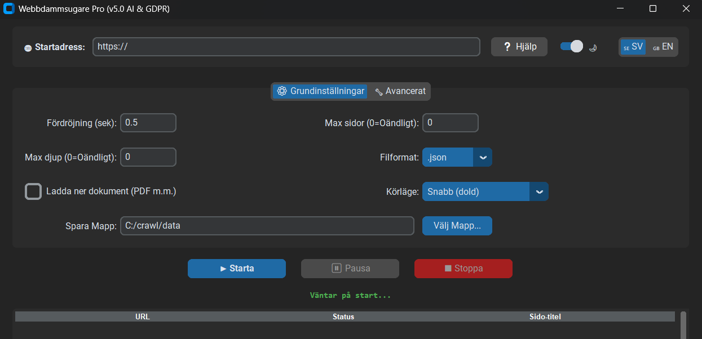

# 🕸️ Webbdammsugare Pro / Web Crawler Pro v3.0 (Playwright Edition)

[](https://github.com/elementarpartikel/ultimate-web-crawler/releases/latest)



**Webbdammsugare Pro** är ett professionellt verktyg för att skrapa, strukturera och lagra innehåll från webbplatser – särskilt framtaget för att generera högkvalitativ textdata för AI-modeller, RAG-pipelines och vektordatabaser.

From v1.7 the interface is fully bilingual. Switch between 🇸🇪 Swedish and 🇬🇧 English directly in the app.

---

## 🆕 Nyheter i v3.0

- **Playwright ersätter Selenium:** Hela JS-renderingen är omskriven med [Playwright](https://playwright.dev/python/). Playwright väntar intelligent på att sidan ska bli klar med sina nätverksanrop (`networkidle`) istället för en fast `sleep()`-tid. Mer stabilt, snabbare och hanterar moderna webbplatser med lazy-loading och API-anrop korrekt.
- **Förbättrat inloggningsflöde:** `login_then_headless`-läget hanteras nu av Playwright med en korrekt context manager. Cookies sparas och förs vidare till både Playwright-kontexten och requests-sessionen – fungerar nu i klassisk och asynkron motor.
- **Tolerant mot HTTPS-fel:** Playwright-kontexten är konfigurerad med `ignore_https_errors=True`, vilket gör att crawlern fungerar på intranät med självutfärdade certifikat utan att krascha.
- **Playwright i async-motorn:** Den asynkrona motorn använder `async_playwright` med ett dubbelt asynkront lås som förhindrar att flera tasks skapar webbläsarinstanser parallellt.

---

## 🚀 Huvudfunktioner

- **Dubbla motorer:** Välj mellan den klassiska trådade motorn (`requests` + Playwright) eller den asynkrona motorn (`aiohttp` + `asyncio` + Playwright).
- **Hybridmotor:** Hämtar sidor med requests/aiohttp och faller automatiskt tillbaka på Playwright-rendering om sidan kräver JavaScript.
- **Intelligent sidväntan:** Playwright väntar på `networkidle` innan HTML:en läses av – ingen mer gissning med fast väntetid.
- **Content-Type Routing:** Kontrollerar serverns headers *innan* en fil laddas ned. Mediafiler ignoreras och dokument skickas till dokumenthanteraren.
- **Smarta filnamn:** Läser `content-disposition`-headern för verkliga filnamn. Unik hash garanterar att inga filer skrivs över.
- **AI/RAG-Optimerad:** Extraherar ren text rensad från menyer, footers och skräpkod med `Trafilatura`, redo för vektordatabaser.
- **Intelligent Caching:** SQLite (WAL-läge) med SHA-256-hash för att hoppa över oförändrade sidor. Async-motorn använder `aiosqlite`.
- **Sitemap-index stöd:** Parsar sitemap-index-filer rekursivt med inbyggt loop-skydd. Async-motorn hämtar undersitemaps parallellt.
- **Prioriterad URL-kö:** URL:er från `sitemap.xml` bearbetas med högre prioritet.
- **Canonical-hantering:** Lägger till kanoniska URL:er i kön och hoppar över originalsidan för att undvika dubbletter.
- **URL-filter:** Uteslut eller kräv nyckelord i URL:er.
- **Automatisk index-fil:** Genererar `index.csv` vid körningens slut.
- **Strikt Domän:** Tvingar crawlern att stanna på exakt angiven domän. Kan stängas av för underdomäner.
- **Manuell inloggning:** Playwright öppnar en synlig webbläsare, väntar på OK-klick, sparar sedan cookies och fortsätter osynligt.
- **Pausa & Återuppta:** Fungerar i båda motorlägena.
- **Utökad Dokumenthantering:** Laddar ned PDF, DOCX, XLSX, PPTX, CSV, ODT m.fl. Pågående nedladdningar slutförs alltid säkert.
- **Valbart utdataformat:** `.md` (rekommenderas för AI/LLM) eller `.txt`.
- **Crawldjup:** Max länknivåer från startsidan (0 = obegränsat).
- **Automatisk retry:** Exponentiell backoff vid nätverksfel (klassisk motor).
- **URL-deduplicering:** `index.html`/`index.php` normaliseras bort. Tracking-parametrar som `utm_source`, `fbclid` m.fl. rensas automatiskt.
- **Förloppsindikator:** Determinate-läge när max sidor är angett, annars löpande animation.
- **Dubbelklick öppnar URL:** Dubbelklicka i tabellen för att öppna sidan i webbläsaren.
- **Anti-stutter:** Loggen trimmas vid 500 rader, GUI-kön bearbetar 20 meddelanden per tick.
- **Tvåspråkigt gränssnitt (SV/EN):** Byt språk i realtid via flaggknappen.
- **Mörkt/Ljust tema:** Switch (🌙 / ☀️) utan omstart.
- **Minnesövervakning:** Garbage collection vid >1 500 MB (kräver valfri `psutil`).
- **Roterande loggfiler:** Per session, max 5 MB × 2 backupfiler.
- **Trådsäker arkitektur:** `threading.Lock` i klassisk motor, `asyncio.Lock` + `asyncio.Semaphore(50)` i async-motorn.

---

## ✅ Krav

| Krav | Detalj |
|---|---|
| **Python** | 3.8+ (klassisk motor) / **3.11+** (async-motor) |
| **Chromium** | Installeras via `playwright install chromium` (se nedan) |

> **Obs!** Playwright laddar ned och hanterar sin egen Chromium-instans – du behöver inte installera Google Chrome manuellt.

---

## 🛠️ Installation

**1. Klona repositoryt:**
```bash
git clone https://github.com/elementarpartikel/ultimate-web-crawler.git
cd ultimate-web-crawler
```

**2. Installera obligatoriska beroenden:**
```bash
pip install -r requirements.txt
```

| Paket | Funktion |
|---|---|
| `requests` | HTTP-hämtning (klassisk motor) |
| `beautifulsoup4` | HTML-parsning |
| `lxml` | HTML- och XML-parsning |
| `playwright` | JS-rendering, inloggning, networkidle-väntan |
| `trafilatura` | AI-optimerad textextraktion (rekommenderas starkt) |
| `customtkinter` | Modernt GUI med mörkt/ljust tema |

**3. Installera Playwrights webbläsare** ⚠️ Obligatoriskt steg:
```bash
playwright install chromium
```

> Detta laddar ned Playwrights egna Chromium-version (~150 MB). Steget behöver bara göras en gång.

**4. Installera valfria beroenden** (aktiverar extrafunktioner):
```bash
pip install aiohttp aiosqlite uvloop psutil
```

| Paket | Funktion |
|---|---|
| `aiohttp` + `aiosqlite` | Aktiverar den asynkrona motorn (kräver Python 3.11+) |
| `uvloop` | Snabbare event loop för async-motorn (Linux/macOS) |
| `psutil` | Realtidsövervakning av minnesanvändning |

---

## 🖥️ Användning / Usage

```bash
python ultimate-web-crawler.py
```

### GUI-inställningar

**Grundinställningar / Basic Settings:**

| Inställning | Beskrivning |
|---|---|
| **Startadress / Start URL** | Komplett URL inklusive `https://` |
| **Fördröjning / Delay** | Sekunder mellan förfrågningar (standard: 0.5 s) |
| **Max sidor / Max pages** | `0` = crawla hela sajten |
| **Max djup / Max depth** | Länknivåer från startsidan (`0` = obegränsat) |
| **Filformat / File Format** | `.md` (rekommenderas för AI) eller `.txt` |
| **Ladda ner dokument** | Sparar PDF, DOCX m.m. i undermappen `dokument/` |
| **Körläge / Run Mode** | Se tabellen nedan |
| **Mapp / Folder** | Katalog för alla sparade filer |

**Körlägen / Run Modes:**

| Svenska | English | Beskrivning |
|---|---|---|
| Snabb (dold) | Fast (hidden) | Kör i bakgrunden utan synligt fönster. Snabbast. |
| Logga in, sen dold | Login, then hidden | Öppnar synlig webbläsare för manuell inloggning, kör sedan i bakgrunden. |
| Synlig (felsökning) | Visible (debugging) | Visar webbläsarfönstret. Bra för att förstå vad som händer. |

**Avancerat / Advanced:**

| Inställning | Beskrivning |
|---|---|
| **Async Mode** | Aktiverar den asynkrona motorn (experimentell, kräver Python 3.11+) |
| **Hybrid-motor** | Väljer automatiskt HTTP-hämtning eller Playwright per sida |
| **Trafilatura** | Aktiverar AI-optimerad textextraktion |
| **Sitemap.xml** | Förladdas rekursivt för effektivare crawling |
| **robots.txt** | Respekterar webbplatsens crawling-regler |
| **Strikt Domän** | Tvingar crawlern att stanna på exakt angiven domän |
| **Uteslut ord i URL** | Kommaseparerad lista – matchande sidor hoppas över |
| **Kräv ord i URL** | Crawlern besöker bara sidor vars URL innehåller minst ett av dessa ord |

> 💡 **Tips:** Dubbelklicka på valfri rad i Live Data-tabellen för att öppna URL:en i din webbläsare.

---

## 📂 Output-struktur

```
crawl_output/
├── texter/                          # En fil per skrapad sida (.md eller .txt)
│   └── sidnamn_a1b2c3.md
├── dokument/                        # Nedladdade PDF, DOCX, XLSX m.m.
├── logs/
│   └── crawl_YYYYMMDD_HHMMSS.log
├── index.csv                        # Översikt: URL, titel, datum, filnamn
└── domännamn_cache.db               # SQLite-cache för incremental crawling
```

Varje textfil inleds med ett metadata-huvud:
```
KÄLLA: https://exempel.se/sida
TITEL: Sidonamn
HÄMTAD: 2025-01-01 12:00:00
============================================================

[Ren sidtext här]
```

---

## 🏗️ Teknisk Stack

| Komponent | Teknik |
|---|---|
| GUI | CustomTkinter (mörkt/ljust tema, tvåspråkigt) |
| HTTP-hämtning | `requests` (klassisk), `aiohttp` (asynkron) |
| JS-rendering | Playwright (`networkidle`, sync + async API) |
| HTML-parsning | `lxml` + BeautifulSoup4, Trafilatura |
| Caching | SQLite3/WAL (klassisk), `aiosqlite` (asynkron) |
| Parallellism | `ThreadPoolExecutor` (klassisk), `asyncio` + `Semaphore(50)` (asynkron) |
| Loggning | RotatingFileHandler |
| Event loop | `asyncio` (standard), `uvloop` (valfri optimering) |

---

## ⚖️ Etik och Ansvar

Detta verktyg är utvecklat för laglig och etisk datainsamling. Användaren ansvarar för att:

- Följa webbplatsens användarvillkor.
- Inte överbelasta servrar – använd den inbyggda fördröjningsfunktionen.
- Respektera de begränsningar som anges i `robots.txt`.
- Säkerställa att insamlad data hanteras i enlighet med GDPR och tillämplig lagstiftning.
