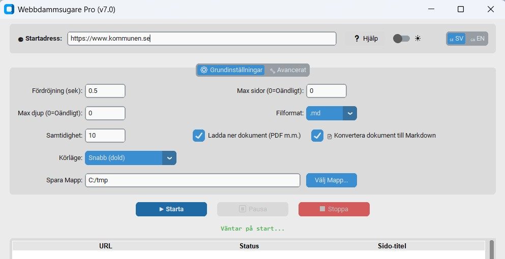

# 🕸️ Webbdammsugare Pro / Web Crawler Pro v7.0

[](https://github.com/elementarpartikel/ultimate-web-crawler/releases/latest)



**Webbdammsugare Pro** är ett professionellt verktyg för att skrapa, strukturera och lagra innehåll från webbplatser – särskilt framtaget för att generera högkvalitativ textdata för AI-modeller, RAG-pipelines och vektordatabaser.

---

## 🚀 Huvudfunktioner

### Crawlning & Nätverk
- **Ren async-arkitektur:** Byggd på `asyncio` och `aiohttp` med valbar samtidighet (standard 10 parallella sidor) och separata Playwright-semaforer (max 2).
- **Inkrementell crawl med conditional GET:** Sparar `ETag` och `Last-Modified` per URL. Vid omcrawl svarar servern `304 Not Modified` för oförändrade sidor – ofta 10–50× snabbare än en första körning.
- **Hybridmotor:** Hämtar sidor snabbt med aiohttp och faller automatiskt tillbaka på Playwright bara när sidan kräver JavaScript-rendering.
- **Riktig CookieJar:** Cookies från Playwright-inloggningen injiceras i aiohttp med korrekt domän/path/secure-flaggor via SAML/SSO-stöd.
- **Per-domän rate limiter:** Respekterar `Crawl-Delay` från `robots.txt` och håller en konfigurerbar fördröjning per domän.
- **Exponentiell backoff:** Återförsöker automatiskt vid 429/5xx med ökande väntetid.
- **Sitemap-parser:** Hanterar XML, gzip-komprimerade `.xml.gz` och rekursiva sitemap-index parallellt med loop-skydd.
- **Login-detektor:** Tre signallager (URL-redirect, HTTP-status, innehållsheuristik) med skydd mot falska positiva på svenska sajter.
- **Prioriterad URL-kö:** URL:er från sitemap ges högre prioritet. Kön boostar URL:er med ord som "policy", "guide" och nedprioriterar arkiv och nyheter.
- **Batched DB-commits:** Skrivningar samlas och commitas var 25:e ändring eller var 5:e sekund – eliminerar fsync per sida.

### Innehållsextraktion
- **Trafilatura-integration:** AI-optimerad textextraktion med stöd för Markdown, tabeller och länkar.
- **Semantisk chunkning:** Strukturerade block (~400 ord, 50 ords överlappning) med rubrik, innehåll, chunk-index och käll-URL per chunk.
- **CMS-boilerplate-rensning:** Automatisk borttagning av Sitevision-chrome (feedback-widget, "Sidan publicerad av" etc.).
- **Absoluta Markdown-länkar:** Relativa `[text](href)`-länkar görs absoluta vid extraktion.
- **URL i varje chunk:** Käll-URL:en injiceras i varje chunk för robustare RAG-källhänvisning.
- **Sitevision-anpassad URL-normalisering:** Strippning av `sv.*`-, `state`- och `logout`-parametrar för stabil deduplicering.

### Dokumenthantering
- **Dokumentnedladdning:** PDF, Word, Excel, PowerPoint, ZIP m.fl.
- **Dokument → Markdown-konvertering:** Extraherar text ur binära dokument och sparar som `.md` med käll-URL i brödtexten – perfekt för RAG-system som behöver citera rätt källa.
- **Smart titelextraktion:** Prioriterar länktext → dokumentmetadata → filnamn → sidtitel. Filtrerar bort generiska texter som "Ladda ner fil", "Download", "Klicka här".
- **Dokument-manifest:** `manifest.json` kopplar varje nedladdat dokument till den sida som hade länken – RAG-systemet kan slå upp rätt intranät-URL.
- **Automatisk extensionsdetektering:** Härleder filändelse från Content-Type och Content-Disposition när URL:en saknar extension.

### Övrigt
- **GDPR PII-tvätt:** E-post, telefonnummer, personnummer och IP-adresser maskeras automatiskt.
- **Mallar via `sites.json`:** Dropdown i GUI:t med alla konfigurationer förfyllda.
- **Tvåspråkigt gränssnitt (SV/EN):** Byt språk i realtid.
- **Ljust/Mörkt tema:** Switch (☀️ / 🌙) utan omstart.
- **Serverläge (CLI):** Kör headless med JSON-konfiguration och valfri webhook-notis.

---

## ✅ Krav

| Krav | Detalj |
|---|---|
| **Python** | **3.11+** |
| **Chromium** | Installeras via `playwright install chromium` (se nedan) |

> **Obs!** Playwright laddar ned och hanterar sin egen Chromium-instans – du behöver inte installera Google Chrome manuellt.

---

## 🛠️ Installation

**1. Klona repositoryt:**
```bash
git clone https://github.com/elementarpartikel/ultimate-web-crawler.git
cd ultimate-web-crawler
```

**2. Installera beroenden:**
```bash
pip install -r requirements.txt
```

| Paket | Funktion |
|---|---|
| `aiohttp` + `aiosqlite` | Asynkron HTTP-hämtning och databas |
| `beautifulsoup4` + `lxml` | HTML- och XML-parsning |
| `playwright` | JS-rendering med Chromium |
| `trafilatura` | AI-optimerad textextraktion |
| `customtkinter` | Modernt GUI med ljust/mörkt tema |

**3. Installera Playwrights webbläsare** ⚠️ Obligatoriskt steg:
```bash
playwright install chromium
```

> Laddar ned Playwrights Chromium (~150 MB). Görs bara en gång.

**4. Installera valfria beroenden (dokumentkonvertering):**
```bash
pip install PyMuPDF python-docx openpyxl python-pptx
```

| Paket | Funktion |
|---|---|
| `PyMuPDF` | PDF-textextraktion |
| `python-docx` | Word-textextraktion (.docx/.dotx) |
| `openpyxl` | Excel-textextraktion (.xlsx) |
| `python-pptx` | PowerPoint-textextraktion (.pptx) |

**5. Övriga valfria beroenden:**
```bash
pip install uvloop brotli
```

| Paket | Funktion |
|---|---|
| `uvloop` | Snabbare event loop (Linux/macOS) |
| `brotli` | Brotli-komprimering i HTTP-svar |

---

## 🖥️ Användning / Usage

```bash
python ultimate-web-crawler.py
```

### Mallar / Templates

Lägg en `sites.json` i samma mapp som `ultimate-web-crawler.py` (eller `.exe`-filen). En **📋 Mall**-dropdown visas automatiskt i GUI:t. Välj en mall och klicka Starta – alla inställningar fylls i och sparmappen sätts automatiskt till en undermapp baserad på mallens namn (t.ex. `crawl_output/skolverket`).

Samma `sites.json` fungerar i serverläge med `--config`. Se "Serverläge" nedan.

### GUI-inställningar

**Grundinställningar / Basic Settings:**

| Inställning | Beskrivning |
|---|---|
| **Startadress / Start URL** | Komplett URL inklusive `https://` |
| **Fördröjning / Delay** | Sekunder mellan förfrågningar per domän (standard: 0.5 s) |
| **Max sidor / Max pages** | `0` = crawla hela sajten |
| **Max djup / Max depth** | Länknivåer från startsidan (`0` = obegränsat) |
| **Samtidighet / Concurrency** | Antal parallella sidor (standard: 10) |
| **Filformat / File Format** | Se tabellen "Utdataformat" nedan |
| **Ladda ner dokument** | Sparar PDF, DOCX m.m. i undermappen `dokument/` |
| **Konvertera dokument till Markdown** | Extraherar text ur dokument och sparar som `.md` med käll-URL |
| **Körläge / Run Mode** | Se tabellen "Körlägen" nedan |
| **Mapp / Folder** | Katalog för alla sparade filer |

**Utdataformat / File Formats:**

| Format | Beskrivning |
|---|---|
| **.json** | Strukturerad data med rubriker, chunks och metadata – rekommenderas för vektordatabaser. |
| **.md** | Markdown med käll-URL i brödtexten – bra för RAG-system och LLM-läsning. Standardval. |
| **.txt** | Ren text. |
| **Ingen text / No text** | Crawlar och laddar enbart ned dokument, sparar ingen sidtext. |

**Körlägen / Run Modes:**

| Svenska | English | Beskrivning |
|---|---|---|
| **Snabb (dold)** | Fast (hidden) | Kör i bakgrunden utan synligt fönster. Snabbast. |
| **Logga in, sen dold** | Login, then hidden | Öppnar synlig webbläsare för manuell inloggning, kör sedan i bakgrunden. |
| **Synlig (felsökning)** | Visible (debugging) | Visar webbläsarfönstret. Bra för att förstå vad som händer. |

**Avancerat / Advanced:**

| Inställning | Beskrivning |
|---|---|
| **Hybrid-motor** | Väljer automatiskt aiohttp eller Playwright per sida |
| **Trafilatura** | Aktiverar AI-optimerad textextraktion |
| **Sitemap.xml** | Förladdas rekursivt, inklusive gzip-komprimerade sitemaps |
| **robots.txt** | Respekterar crawling-regler och Crawl-Delay |
| **Strikt Domän** | Tvingar crawlern att stanna på exakt angiven domän |
| **Uteslut ord i URL** | Kommaseparerad lista – URL:er som matchar hoppas över |
| **Kräv ord i URL (något av)** | Crawlern besöker bara sidor vars URL innehåller minst ett av dessa ord (ELLER-logik) |

**PII-Tvätt / PII Wash (GDPR):**

| Inställning | Vad som maskeras |
|---|---|
| **Radera E-post** | kontakt@myndighet.se → `[E-POST]` |
| **Radera Telefonnummer** | Svenska format inkl. landskod och parenteser → `[TELEFON]` |
| **Radera Personnummer** | Vanliga PNR och samordningsnummer → `[PERSONNUMMER]` |
| **Radera IP-adresser** | IPv4-adresser → `[IP-ADRESS]` |

> 💡 **Tips:** Dubbelklicka på valfri rad i *Live Data*-tabellen för att öppna URL:en i din webbläsare.

---

## 💻 Serverläge / Server Mode

Kör crawlern headless med en JSON-konfigurationsfil – perfekt för schemalagd körning med `cron` eller Task Scheduler:

```bash
python ultimate-web-crawler.py --config sites.json
python ultimate-web-crawler.py --config sites.json --webhook "https://hooks.slack.com/..."
```

> Webhook-URL kan även anges via miljövariabeln `WEBHOOK_URL`. Max 3 sajter körs parallellt. Varje sajt crawlas i sin egen undermapp under `server_data/`.

### Exempel på `sites.json`

Nedan visas tre vanliga konfigurationer: RAG-optimerad text, dokumentnedladdning med Markdown-konvertering, och intranätscrawl med inloggning.

```json
[
  {
    "name": "Skolverket (RAG & AI-text)",
    "start_url": "https://www.skolverket.se",
    "delay": 0.5,
    "max_pages": 500,
    "max_depth": 3,
    "concurrency": 10,
    "save_format": ".md",
    "headless_mode": "headless",
    "find_sitemap": true,
    "respect_robots": true,
    "use_hybrid": true,
    "use_trafilatura": true,
    "download_docs": false,
    "convert_docs_to_md": false,
    "strict_domain": true,
    "exclude_keywords": ["images", "login", "kalender"],
    "require_keywords": [],
    "remove_email": true,
    "remove_phone": true,
    "remove_pnr": true,
    "remove_ip": false
  },
  {
    "name": "SKR (Dokument + Markdown)",
    "start_url": "https://skr.se",
    "delay": 0.5,
    "max_pages": 500,
    "max_depth": 1,
    "concurrency": 10,
    "save_format": "Ingen text",
    "headless_mode": "headless",
    "find_sitemap": true,
    "respect_robots": true,
    "use_hybrid": true,
    "use_trafilatura": false,
    "download_docs": true,
    "convert_docs_to_md": true,
    "strict_domain": true,
    "exclude_keywords": [],
    "require_keywords": [],
    "remove_email": false,
    "remove_phone": false,
    "remove_pnr": false,
    "remove_ip": false
  },
  {
    "name": "Kommun-intranät (inloggning)",
    "start_url": "https://intranat.kommun.se",
    "delay": 1.0,
    "max_pages": 0,
    "max_depth": 0,
    "concurrency": 5,
    "save_format": ".md",
    "headless_mode": "login_then_headless",
    "find_sitemap": true,
    "respect_robots": false,
    "use_hybrid": true,
    "use_trafilatura": true,
    "download_docs": true,
    "convert_docs_to_md": true,
    "strict_domain": true,
    "exclude_keywords": ["logout", "kalender", "arkiv"],
    "require_keywords": [],
    "remove_email": true,
    "remove_phone": true,
    "remove_pnr": true,
    "remove_ip": true
  }
]
```

---

## 📂 Output-struktur

```text
crawl_output/
├── texter/                          # En fil per skrapad sida
│   └── sidnamn_a1b2c3.md           # eller .json / .txt
├── dokument/                        # Nedladdade PDF, DOCX, XLSX m.m.
├── logs/
│   └── crawl_YYYYMMDD_HHMMSS.log
├── index.csv                        # Översikt: URL, titel, datum, filnamn
├── manifest_domännamn.json          # Kopplar dokument till ursprungssida
└── domännamn_cache.db               # SQLite-cache för inkrementell crawling
```

### JSON-format per sida:

```json
{
  "title": "Kontakta oss - Skolverket",
  "url": "https://www.skolverket.se/kontakt",
  "crawled_at": "2026-04-03T12:00:00",
  "author": "",
  "published_date": "",
  "modified_date": "2026-03-15",
  "language": "sv",
  "og_type": "",
  "description": "Så når du Skolverket",
  "keywords": ["kontakt"],
  "plain_text": "## Ring oss\nNi når oss på [TELEFON]...",
  "chunks": [
    {
      "heading": "Ring oss",
      "content": "Ni når oss på [TELEFON]. Vår e-post är [E-POST].",
      "chunk_index": 1,
      "total_chunks": 3,
      "url": "https://www.skolverket.se/kontakt"
    }
  ]
}
```

### Markdown-format per sida:

```markdown
# Kontakta oss - Skolverket

**Källa:** https://www.skolverket.se/kontakt

---

## Ring oss
Ni når oss på [TELEFON]. Vår e-post är [E-POST].

---

**Källa:** https://www.skolverket.se/kontakt
```

### Konverterat dokument (Markdown):

```markdown
# Budget 2025

**Källa:** https://intranat.kommun.se/ekonomi
**Dokument-URL:** https://intranat.kommun.se/download/budget-2025.pdf
**Filnamn:** budget-2025.pdf
**Filtyp:** PDF

---

## Sida 1

[dokumenttext...]

---

**Källa:** https://intranat.kommun.se/ekonomi
**Dokument-URL:** https://intranat.kommun.se/download/budget-2025.pdf
```

---

## ⚖️ Etik och Ansvar

Detta verktyg är utvecklat för laglig och etisk datainsamling. Användaren ansvarar för att:

- Följa webbplatsens användarvillkor.
- Inte överbelasta servrar – använd den inbyggda fördröjningsfunktionen.
- Respektera de begränsningar som anges i `robots.txt`.
- Säkerställa att insamlad data hanteras i enlighet med GDPR och tillämplig lagstiftning.
