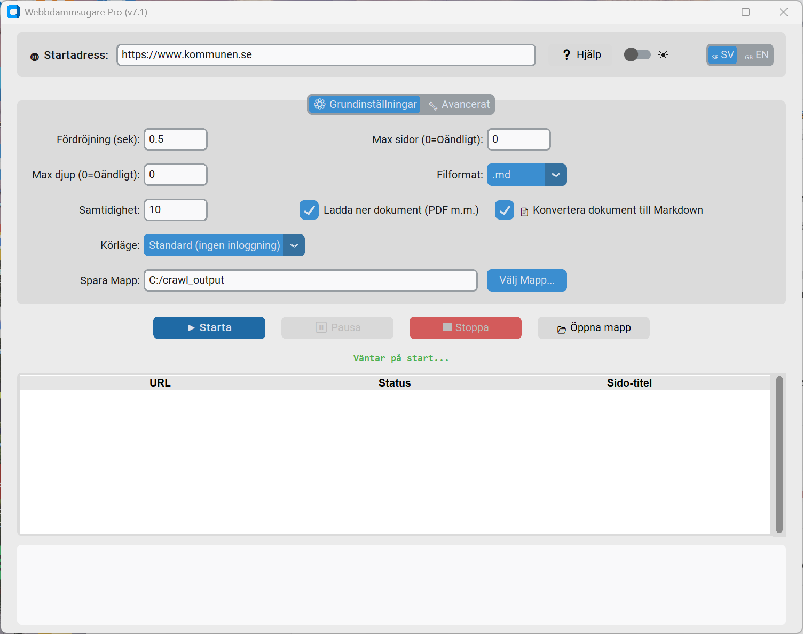

# 🕸️ Webbdammsugare Pro / Web Crawler Pro v7.1



**Webbdammsugare Pro** är ett professionellt verktyg för att skrapa, strukturera och lagra innehåll från webbplatser – särskilt framtaget för att generera högkvalitativ textdata för AI-modeller, RAG-pipelines och vektordatabaser.

---

## 🚀 Huvudfunktioner

### Crawlning & Nätverk
- **Ren async-arkitektur:** Byggd på `asyncio` och `aiohttp` med valbar samtidighet (standard 10 parallella sidor) och separata Playwright-semaforer (max 2).
- **Inkrementell crawl med conditional GET:** Sparar `ETag`, `Last-Modified` *och sidans länkar* per URL. Vid omcrawl svarar servern `304 Not Modified` för oförändrade sidor, och de sparade länkarna spelas upp så att undersidorna ändå besöks – ändrade undersidor upptäcks alltså även om föräldersidan är oförändrad. Sidor som försvunnit (404/410) raderas och rapporteras. Dokument hämtas om när de ändrats.
- **Ändringslogg och rapport:** Varje körning skriver `changes.jsonl` (ny / ändrad / borttagen sida och dokument) och `crawl_report.json` (luckor, fel och varningar) – tänkt som underlag för att synka Svea inkrementellt.
- **Hybridmotor:** Hämtar sidor snabbt med aiohttp och faller automatiskt tillbaka på Playwright bara när sidan kräver JavaScript-rendering.
- **Riktig CookieJar:** Cookies från Playwright-inloggningen injiceras i aiohttp med korrekt domän/path/secure-flaggor via SAML/SSO-stöd.
- **Per-domän rate limiter:** Respekterar `Crawl-Delay` från `robots.txt` och håller en konfigurerbar fördröjning per domän. Saktar ner automatiskt vid 429/503.
- **Exponentiell backoff:** Återförsöker automatiskt vid 429/5xx med ökande väntetid och respekterar `Retry-After`.
- **Skydd mot crawl-fällor:** Hoppar över extremt djupa sökvägar, upprepade sökvägssegment och URL:er med många query-parametrar. `max_pages` räknar färdiga *och* pågående sidor, även när kön fyllts från en stor sitemap.
- **Canonical och dubbletter:** sidor som pekar ut en annan URL som original (`<link rel="canonical">`) sparas inte som kopia – originalet besöks i stället. Sidor med identiskt innehåll på olika URL:er (utskriftsversioner, språkvarianter) sparas bara en gång. Skydd finns mot felkonfigurerade sajter där alla sidor pekar på startsidan, och mot canonical-cykler. Allt listas i `crawl_report.json`.
- **Sitemapens `lastmod`:** sidor som sitemapen säger är oförändrade sedan senaste hämtningen hämtas inte alls (länkarna spelas upp från cachen). Säkerhetsventil: poster äldre än `sitemap_lastmod_max_age_days` (standard 14) kontrolleras ändå med villkorlig GET, eftersom vissa sajter har felaktig `lastmod`.
- **Språkfilter:** `languages` (t.ex. `["sv"]`, eller fältet "Bara språk" i GUI:t) hoppar över sidor vars `<html lang>` är ett annat språk – och följer inte deras länkar.
- **Bot-skydd och soft-404:** Cloudflare-utmaningar och "Sidan hittades inte"-sidor med statuskod 200 sparas inte som innehåll.
- **Sitemap-parser:** Hanterar XML, gzip-komprimerade `.xml.gz` och rekursiva sitemap-index parallellt med loop-skydd.
- **Login-detektor:** Tre signallager (URL-redirect, HTTP-status, innehållsheuristik) med skydd mot falska positiva på svenska sajter.
- **Prioriterad URL-kö:** URL:er från sitemap ges högre prioritet. Kön boostar URL:er med ord som "policy", "guide" och nedprioriterar arkiv och nyheter.
- **Batched DB-commits:** Skrivningar samlas och commitas var 25:e ändring eller var 5:e sekund – eliminerar fsync per sida.

### Innehållsextraktion
- **Trafilatura-integration:** AI-optimerad textextraktion med stöd för Markdown, tabeller och länkar.
- **Semantisk chunkning:** Strukturerade block (~400 ord, 50 ords överlappning) med rubrik, **rubrikväg** (`Skola > Förskola > Avgifter`), `context` (titel + rubrikväg), innehåll, chunk-index och käll-URL per chunk. Tabeller och listor behåller sina radbrytningar.
- **CMS-boilerplate-rensning:** Automatisk borttagning av Sitevision-chrome (feedback-widget, "Sidan publicerad av" etc.) i *alla* utdataformat.
- **Metadata i brödtexten:** `.md`-filer innehåller **Senast ändrad**, **Hämtad** och **Språk** som synlig text, så att frågor om hur aktuell en sida är kan besvaras.
- **Sidtitel utan sajtnamn:** "Avgifter - Tyresö kommun" blir "Avgifter".
- **Absoluta Markdown-länkar:** Relativa `[text](href)`-länkar görs absoluta vid extraktion.
- **URL i varje chunk:** Käll-URL:en injiceras i varje chunk för robustare RAG-källhänvisning.
- **Sitevision-anpassad URL-normalisering:** Strippning av `sv.*`-, `state`- och `logout`-parametrar för stabil deduplicering.

### Dokumenthantering
- **Dokumentnedladdning:** PDF, Word, Excel, PowerPoint, ZIP m.fl.
- **Dokument → Markdown-konvertering:** Extraherar text ur binära dokument och sparar som `.md` med käll-URL i brödtexten – perfekt för RAG-system som behöver citera rätt källa.
- **Smart titelextraktion:** Prioriterar länktext → dokumentmetadata → filnamn → sidtitel. Filtrerar bort generiska texter som "Ladda ner fil", "Download", "Klicka här".
- **Dokument-manifest:** `manifest.json` kopplar varje nedladdat dokument till den sida som hade länken – RAG-systemet kan slå upp rätt intranät-URL.
- **Automatisk extensionsdetektering:** Härleder filändelse från Content-Type och Content-Disposition när URL:en saknar extension.
- **Säkra nedladdningar:** Skrivs till `.part` och byts atomärt, storleksgräns (`max_download_mb`, standard 100), och filens första byte kontrolleras mot filtypen (en HTML-inloggningssida sparas aldrig som `.pdf`).
- **Uppdaterade dokument:** Dokument hämtas om med villkorlig GET (ETag/Last-Modified) och konverteras om när de ändrats; oförändrade hoppas över.
- **Äldre format:** `.doc`, `.xls`, `.ppt`, `.odt`, `.rtf` m.fl. konverteras via LibreOffice om `soffice` finns. Tabeller i Word hamnar där de står, dolda Excel-blad hoppas över.
- **OCR för skannade PDF:er:** sidor utan textlager läses med Tesseract (via PyMuPDF) om det är installerat – se "OCR" nedan. Texten märks `**Textkälla:** OCR` eftersom den kan innehålla fel. Utan Tesseract listas skannade PDF:er i `crawl_report.json` i stället för att försvinna tyst.

### Övrigt
- **GDPR PII-tvätt:** E-post, telefonnummer, personnummer och IP-adresser maskeras. Tvätten gäller nu även länktexter, titlar och dokumenttitlar. I GUI:t är e-post, telefon och personnummer påslagna som standard. `"keep_role_emails": true` behåller funktionsbrevlådor som `kontakt@` och `registrator@`. **Obs:** namn maskeras inte – tvätten ersätter inte en riktig GDPR-bedömning.
- **Prompt-injektion:** Sidor med dolda instruktioner riktade mot AI (dold text, kommentarer) flaggas i `crawl_report.json`; dold text används aldrig som innehåll.
- **Mallar via `sites.json`:** Dropdown i GUI:t med alla konfigurationer förfyllda.
- **Tvåspråkigt gränssnitt (SV/EN):** Byt språk i realtid.
- **Ljust/Mörkt tema:** Switch (☀️ / 🌙) utan omstart.
- **Serverläge (CLI):** Kör headless med JSON-konfiguration och valfri webhook-notis.

---

## ✅ Krav

| Krav | Detalj |
|---|---|
| **Python** | **3.11+** |
| **Chromium** | Installeras via `playwright install chromium` (se nedan) |

> **Obs!** Playwright laddar ned och hanterar sin egen Chromium-instans – du behöver inte installera Google Chrome manuellt.

---

## 🛠️ Installation

**1. Klona repositoryt:**
```bash
git clone https://github.com/elementarpartikel/ultimate-web-crawler.git
cd ultimate-web-crawler
```

**2. Installera beroenden:**
```bash
pip install -r requirements.txt
```

| Paket | Funktion |
|---|---|
| `aiohttp` + `aiosqlite` | Asynkron HTTP-hämtning och databas |
| `beautifulsoup4` + `lxml` | HTML- och XML-parsning |
| `playwright` | JS-rendering med Chromium |
| `trafilatura` | AI-optimerad textextraktion |
| `customtkinter` | Modernt GUI med ljust/mörkt tema |

**3. Installera Playwrights webbläsare** ⚠️ Obligatoriskt steg:
```bash
playwright install chromium
```

> Laddar ned Playwrights Chromium (~150 MB). Görs bara en gång.

**4. Installera valfria beroenden (dokumentkonvertering):**
```bash
pip install PyMuPDF python-docx openpyxl python-pptx
```

| Paket | Funktion |
|---|---|
| `PyMuPDF` | PDF-textextraktion |
| `python-docx` | Word-textextraktion (.docx/.dotx) |
| `openpyxl` | Excel-textextraktion (.xlsx) |
| `python-pptx` | PowerPoint-textextraktion (.pptx) |

**5. Övriga valfria beroenden:**
```bash
pip install uvloop brotli
```

| Paket | Funktion |
|---|---|
| `uvloop` | Snabbare event loop (Linux/macOS) |
| `brotli` | Brotli-komprimering i HTTP-svar |

---

## 🖥️ Användning / Usage

```bash
python ultimate-web-crawler.py
```

### Mallar / Templates

Lägg en `sites.json` i samma mapp som `ultimate-web-crawler.py` (eller `.exe`-filen). En **📋 Mall**-dropdown visas automatiskt i GUI:t. Välj en mall och klicka Starta – alla inställningar fylls i och sparmappen sätts automatiskt till en undermapp baserad på mallens namn (t.ex. `crawl_output/skolverket`).

Samma `sites.json` fungerar i serverläge med `--config`. Se "Serverläge" nedan.

### GUI-inställningar

**Grundinställningar / Basic Settings:**

| Inställning | Beskrivning |
|---|---|
| **Startadress / Start URL** | Komplett URL inklusive `https://` |
| **Fördröjning / Delay** | Sekunder mellan förfrågningar per domän (standard: 0.5 s) |
| **Max sidor / Max pages** | `0` = crawla hela sajten |
| **Max djup / Max depth** | Länknivåer från startsidan (`0` = obegränsat) |
| **Samtidighet / Concurrency** | Antal parallella sidor (standard: 10) |
| **Filformat / File Format** | Se tabellen "Utdataformat" nedan |
| **Ladda ner dokument** | Sparar PDF, DOCX m.m. i undermappen `dokument/` |
| **Konvertera dokument till Markdown** | Extraherar text ur dokument och sparar som `.md` med käll-URL |
| **Körläge / Run Mode** | Se tabellen "Körlägen" nedan |
| **Full omcrawl** (Avancerat) | Ignorerar cachen och hämtar allt på nytt |
| **Mapp / Folder** | Katalog för alla sparade filer |

**Utdataformat / File Formats:**

| Format | Beskrivning |
|---|---|
| **.json** | Strukturerad data med rubriker, chunks och metadata – rekommenderas för vektordatabaser. |
| **.md** | Markdown med käll-URL i brödtexten – bra för RAG-system och LLM-läsning. Standardval. |
| **.txt** | Ren text. |
| **Ingen text / No text** | Crawlar och laddar enbart ned dokument, sparar ingen sidtext. |

**Körlägen / Run Modes:**

| Svenska | English | Beskrivning |
|---|---|---|
| **Standard (ingen inloggning)** | Standard (no login) | Kör i bakgrunden utan synligt fönster. För sajter utan inloggning. |
| **Logga in först, sen automatiskt** | Log in first, then automatic | Öppnar synlig webbläsare för manuell inloggning, kör sedan i bakgrunden. |
| **Synlig webbläsare (felsökning)** | Visible browser (debugging) | Visar webbläsarfönstret. Bra för att förstå vad som händer. |

**Avancerat / Advanced:**

| Inställning | Beskrivning |
|---|---|
| **Hybrid-motor** | Väljer automatiskt aiohttp eller Playwright per sida |
| **Trafilatura** | Aktiverar AI-optimerad textextraktion |
| **Sitemap.xml** | Förladdas rekursivt, inklusive gzip-komprimerade sitemaps |
| **robots.txt** | Respekterar crawling-regler och Crawl-Delay |
| **Strikt Domän** | Tvingar crawlern att stanna på exakt angiven domän |
| **Uteslut ord i URL** | Kommaseparerad lista – URL:er som matchar hoppas över |
| **Kräv ord i URL (något av)** | Crawlern besöker bara sidor vars URL innehåller minst ett av dessa ord (ELLER-logik) |

**PII-Tvätt / PII Wash (GDPR):**

| Inställning | Vad som maskeras |
|---|---|
| **Radera E-post** | kontakt@myndighet.se → `[E-POST]` |
| **Radera Telefonnummer** | Svenska format inkl. landskod och parenteser → `[TELEFON]` |
| **Radera Personnummer** | Vanliga PNR och samordningsnummer → `[PERSONNUMMER]` |
| **Radera IP-adresser** | IPv4-adresser → `[IP-ADRESS]` |

> 💡 **Tips:** Dubbelklicka på valfri rad i *Live Data*-tabellen för att öppna URL:en i din webbläsare.

---

## 💻 Serverläge / Server Mode

Kör crawlern headless med en JSON-konfigurationsfil – perfekt för schemalagd körning med `cron` eller Task Scheduler:

```bash
python ultimate-web-crawler.py --config sites.json
python ultimate-web-crawler.py --config sites.json --webhook "https://hooks.slack.com/..."
```

> Webhook-URL kan även anges via miljövariabeln `WEBHOOK_URL`. Max 3 sajter körs parallellt. Varje sajt crawlas i sin egen undermapp under `server_data/` (ändra med `--output MAPP` – viktigt för Task Scheduler, där arbetskatalogen ofta är fel).
>
> Serverläget kräver **inte** tkinter/customtkinter och fungerar på headless Linux. Processen avslutas med **exit-kod 0** om allt gick bra, **1** om någon sajt misslyckades eller hade ogiltig konfiguration, och **2** vid oläsbar konfigurationsfil – så att schemaläggaren kan larma. Okända nycklar i `sites.json` ger en varning, en saknad/ogiltig `start_url` hoppar över just den sajten.

### Inloggning i serverläge (`cookie_file`)

Interaktiv inloggning kräver GUI. För schemalagda intranätskörningar: sätt `"headless_mode": "login_then_headless"` och `"cookie_file": "C:/secure/cookies.json"`. Kör först en inloggad crawl i GUI:t (samma `cookie_file` i mallen) – sessionscookies sparas då i filen. Serverläget läser filen och kontrollerar att sessionen fortfarande gäller; har den gått ut avbryts körningen med ett tydligt fel (och exit-kod 1). **Cookie-filen motsvarar ett lösenord** – lägg den i en skyddad mapp. Efter 5 sessionsfel i rad avbryts crawlen i stället för att fortsätta utan inloggning.

### Avancerade nycklar i `sites.json`

| Nyckel | Standard | Beskrivning |
|---|---|---|
| `cookie_file` | – | Sökväg där sessionscookies sparas/läses (se ovan) |
| `user_agent` | `UltimateWebCrawler/7.1 (+repo-URL)` | Crawlern identifierar sig ärligt; sätt egen vid behov |
| `allowed_domains` | `[]` | Extra domäner som räknas som "samma sajt" vid `strict_domain` |
| `include_subdomains` | `false` | Tillåt underdomäner till startdomänen |
| `max_page_mb` / `max_download_mb` | `10` / `100` | Storleksgränser för sidor respektive dokument |
| `max_path_segments` / `max_query_params` | `15` / `5` | Gränser mot crawl-fällor |
| `keep_query_params` / `ignore_query_params` | `[]` | Justera vilka URL-parametrar som tas bort vid deduplicering (standardlistan innehåller t.ex. `state`, `ref`, `source`, `sv.*`) |
| `boost_words` / `penalty_words` | se kod | Ord i URL som höjer/sänker prioritet |
| `keep_role_emails` | `false` | Behåll `kontakt@`-liknande funktionsbrevlådor vid e-posttvätt |
| `ignore_https_errors` | `false` | Ignorera certifikatfel i webbläsaren (intranät med egen CA) |
| `allow_private_hosts` | automatiskt | Tillåt privata IP-adresser. På automatiskt om startadressen själv är privat/intranät |
| `incremental` | `true` | `false` = full omcrawl |
| `languages` | `[]` (alla) | Bara dessa språk, t.ex. `["sv"]` |
| `respect_canonical` | `true` | Spara inte sidor som pekar ut en annan URL som original |
| `dedupe_content` | `true` | Spara bara en kopia av sidor med identiskt innehåll |
| `use_sitemap_lastmod` | `true` | Hoppa över sidor som sitemapen säger är oförändrade |
| `sitemap_lastmod_max_age_days` | `14` | Kontrollera poster äldre än så ändå |
| `export_jsonl` | `true` | Skriv `chunks.jsonl` (en chunk per rad) |
| `ocr` / `ocr_languages` / `ocr_max_pages` | `true` / `swe+eng` / `50` | OCR av skannade PDF:er (kräver Tesseract) |

### Exempel på `sites.json`

Nedan visas tre vanliga konfigurationer: RAG-optimerad text, dokumentnedladdning med Markdown-konvertering, och intranätscrawl med inloggning.

```json
[
  {
    "name": "Skolverket (RAG & AI-text)",
    "start_url": "https://www.skolverket.se",
    "delay": 0.5,
    "max_pages": 500,
    "max_depth": 3,
    "concurrency": 10,
    "save_format": ".md",
    "headless_mode": "headless",
    "find_sitemap": true,
    "respect_robots": true,
    "use_hybrid": true,
    "use_trafilatura": true,
    "download_docs": false,
    "convert_docs_to_md": false,
    "strict_domain": true,
    "exclude_keywords": ["images", "login", "kalender"],
    "require_keywords": [],
    "remove_email": true,
    "remove_phone": true,
    "remove_pnr": true,
    "remove_ip": false
  },
  {
    "name": "SKR (Dokument + Markdown)",
    "start_url": "https://skr.se",
    "delay": 0.5,
    "max_pages": 500,
    "max_depth": 1,
    "concurrency": 10,
    "save_format": "Ingen text",
    "headless_mode": "headless",
    "find_sitemap": true,
    "respect_robots": true,
    "use_hybrid": true,
    "use_trafilatura": false,
    "download_docs": true,
    "convert_docs_to_md": true,
    "strict_domain": true,
    "exclude_keywords": [],
    "require_keywords": [],
    "remove_email": false,
    "remove_phone": false,
    "remove_pnr": false,
    "remove_ip": false
  },
  {
    "name": "Kommun-intranät (inloggning)",
    "start_url": "https://intranat.kommun.se",
    "delay": 1.0,
    "max_pages": 0,
    "max_depth": 0,
    "concurrency": 5,
    "save_format": ".md",
    "headless_mode": "login_then_headless",
    "find_sitemap": true,
    "respect_robots": false,
    "use_hybrid": true,
    "use_trafilatura": true,
    "download_docs": true,
    "convert_docs_to_md": true,
    "strict_domain": true,
    "exclude_keywords": ["logout", "kalender", "arkiv"],
    "require_keywords": [],
    "remove_email": true,
    "remove_phone": true,
    "remove_pnr": true,
    "remove_ip": true
  }
]
```

---

## 📂 Output-struktur

```text
crawl_output/
├── texter/                          # En fil per skrapad sida
│   ├── sidnamn_a1b2c3d4.md          # eller .json / .txt
│   └── dokumentnamn_a1b2c3d4_doc.md # konverterade dokument
├── dokument/                        # Nedladdade PDF, DOCX, XLSX m.m.
├── logs/
│   └── crawl_YYYYMMDD_HHMMSS.log
├── index.csv                        # Översikt: URL, titel, datum, filnamn (endast befintliga filer)
├── chunks.jsonl                     # Alla chunks, en per rad – färdig att läsa in i en vektordatabas
├── changes.jsonl                    # Logg över nytt/ändrat/borttaget (läggs till vid varje körning)
├── crawl_report.json                # Luckor, fel, varningar och sidor som inte nåtts sedan sist
├── manifest_domännamn.json          # Kopplar dokument till ursprungssida
└── domännamn_cache.db               # SQLite-cache för inkrementell crawling
```

### JSON-format per sida:

```json
{
  "title": "Kontakta oss - Skolverket",
  "url": "https://www.skolverket.se/kontakt",
  "crawled_at": "2026-04-03T12:00:00",
  "author": "",
  "published_date": "",
  "modified_date": "2026-03-15",
  "language": "sv",
  "og_type": "",
  "description": "Så når du Skolverket",
  "keywords": ["kontakt"],
  "flags": [],
  "plain_text": "## Ring oss\nNi når oss på [TELEFON]...",
  "chunks": [
    {
      "heading": "Ring oss",
      "heading_path": "Ring oss",
      "context": "Kontakta oss > Ring oss",
      "content": "Ni når oss på [TELEFON]. Vår e-post är [E-POST].",
      "chunk_index": 1,
      "total_chunks": 3,
      "url": "https://www.skolverket.se/kontakt"
    }
  ]
}
```

### Markdown-format per sida:

```markdown
# Kontakta oss - Skolverket

**Källa:** https://www.skolverket.se/kontakt
**Senast ändrad:** 2026-03-15
**Hämtad:** 2026-04-03
**Språk:** sv

---

## Ring oss
Ni når oss på [TELEFON]. Vår e-post är [E-POST].

---

**Källa:** https://www.skolverket.se/kontakt
```

### Konverterat dokument (Markdown):

```markdown
# Budget 2025

**Källa:** https://intranat.kommun.se/ekonomi
**Dokument-URL:** https://intranat.kommun.se/download/budget-2025.pdf
**Filnamn:** budget-2025.pdf
**Filtyp:** PDF

---

## Sida 1

[dokumenttext...]

---

**Källa:** https://intranat.kommun.se/ekonomi
**Dokument-URL:** https://intranat.kommun.se/download/budget-2025.pdf
```

---

## 📦 chunks.jsonl – inläsning i Svea/vektordatabas

`chunks.jsonl` byggs efter varje körning av *alla* sparade sidor och dokument (även oförändrade), så filen är alltid komplett. Varje rad:

```json
{"id": "a1b2c3d4e5-1", "url": "https://…/avgifter", "title": "Avgifter", "source_type": "page",
 "referer_url": "", "language": "sv", "modified_date": "2026-03-15", "crawled_at": "2026-04-03",
 "heading": "Förskola", "heading_path": "Avgifter > Förskola", "context": "Avgifter > Avgifter > Förskola",
 "content": "…", "chunk_index": 1, "total_chunks": 4}
```

För dokument är `source_type` `document`, `url` dokumentets adress och `referer_url` sidan som länkade till det. `id` är stabilt mellan körningar. Kombinera med `changes.jsonl` för att bara uppdatera det som ändrats.

---

## 🔍 OCR (skannade PDF:er)

Många kommunala PDF:er är inskannade bilder utan text. För att läsa dem:

1. Installera **Tesseract** (Windows: installationsprogram från UB Mannheim; se till att *Swedish* väljs under språkdata) och lägg det i `PATH`.
2. Klart – crawlern märker det automatiskt. Sidor utan textlager OCR-läses (max `ocr_max_pages` per dokument, standard 50; OCR är långsamt).

Saknas Tesseract syns skannade dokument under `conversion_failures` i `crawl_report.json` med orsaken. OCR-text kan innehålla fel och märks därför i dokumentet.

---

## 🔒 Säkerhet och dataskydd

- **Åtkomststyrning:** Crawlar du ett intranät med en användares inloggning hamnar *allt* den användaren ser i utdata – och därmed potentiellt i Svea för alla. Använd ett dedikerat konto med minimala rättigheter och granska vad som matas in.
- **Nätverk:** Crawlern vägrar privata/loopback/link-local-adresser (inkl. via redirects och sitemaps) när startadressen är publik – skydd mot SSRF. Intranät (privat startadress) fungerar som vanligt.
- **Begränsningar:** Gränser för sidstorlek, nedladdningsstorlek och dekomprimerade sitemaps. XML med entiteter avvisas.
- **HTTPS:** Certifikatfel ignoreras bara om `ignore_https_errors` uttryckligen sätts.
- **Cookie-filen** (`cookie_file`) motsvarar ett lösenord. Den läggs aldrig i loggar och bör ligga i en skyddad mapp.
- **Utdata är opålitlig indata** till en LLM: sidor kan innehålla instruktioner riktade mot AI. Flaggade sidor listas i `crawl_report.json` under `possible_prompt_injection`.
- **Dokumentparsning** (PDF/Office) sker i samma process. Crawla inte sajter du inte litar på utan att begränsa `max_download_mb`.

---

## 🧪 Tester

```bash
pip install pytest
python -m pytest tests -q
```

Testerna körs mot en lokal testserver (ingen riktig sajt berörs) och täcker bl.a. `max_pages` med sitemap, inkrementell crawl, borttagna sidor, dokumentuppdatering, SSRF-skydd, bot-sidor, serverläge utan tkinter och exit-koder, samt – med riktig Chromium – JavaScript-rendering, hela inloggningsflödet (interaktiv inloggning, `cookie_file`, utgången session) och nedladdningsfallbacken. OCR och LibreOffice testas bara i kopplingen (med attrapper); själva programmen testas inte.

---

## ⚖️ Etik och Ansvar

Detta verktyg är utvecklat för laglig och etisk datainsamling. Användaren ansvarar för att:

- Följa webbplatsens användarvillkor.
- Inte överbelasta servrar – använd den inbyggda fördröjningsfunktionen.
- Respektera de begränsningar som anges i `robots.txt`. Crawlern identifierar sig som `UltimateWebCrawler` och följer `*`/`$`-regler när `protego` är installerat.
- Säkerställa att insamlad data hanteras i enlighet med GDPR och tillämplig lagstiftning.
